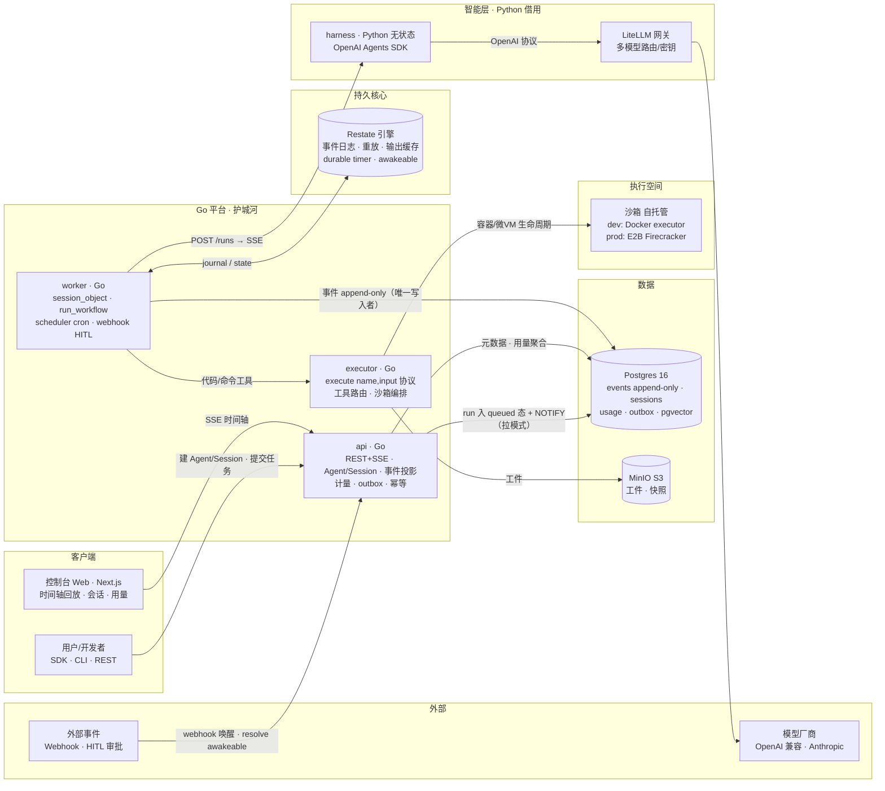
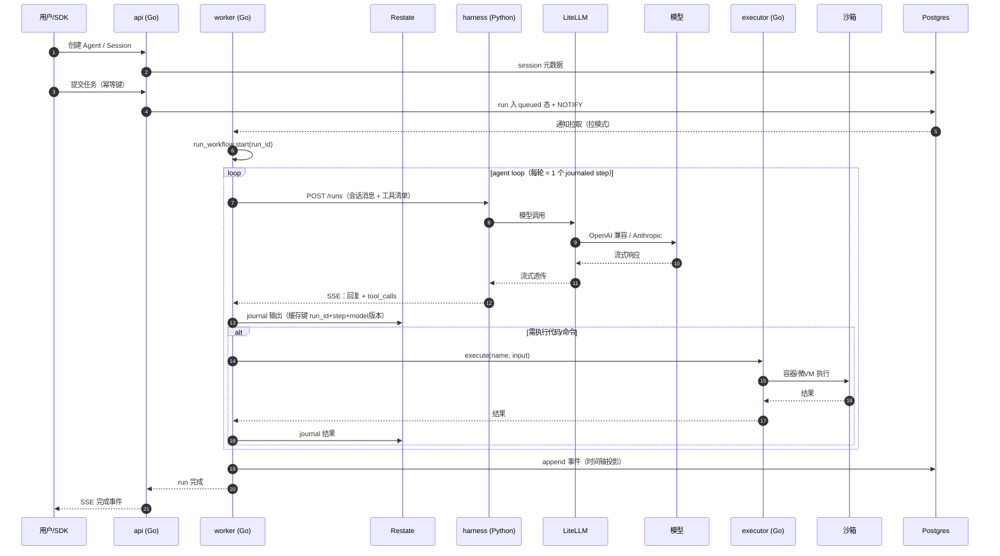
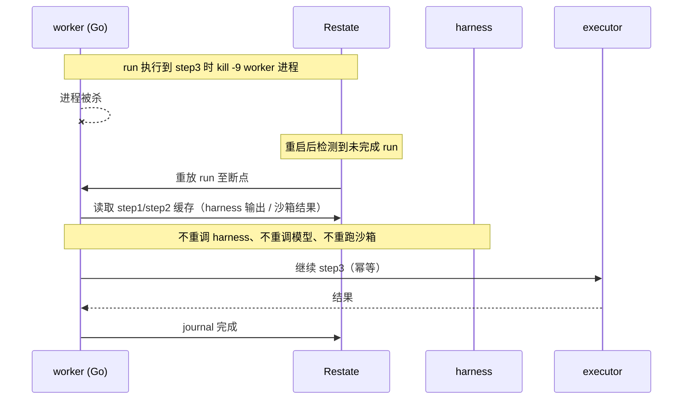
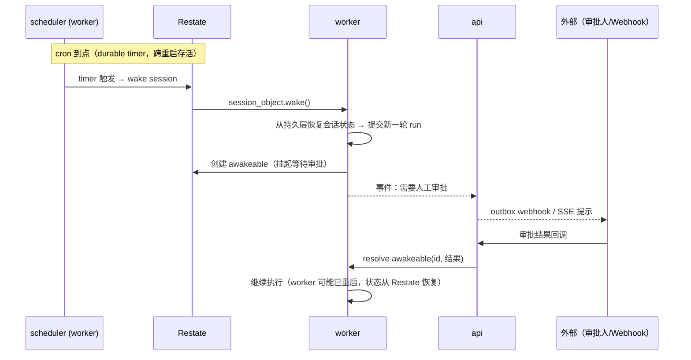
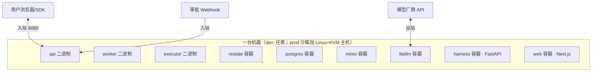

# MVP 架构设计（v3：Go 平台 + 借 harness）

> 项目：**Chronotope（时空可组合持久运行时）**
> 配套：[mvp-技术选型.md](./mvp-技术选型.md) · 渲染图：[mvp-架构图.png](./mvp-架构图.png)（源文件 [mvp-架构图.svg](./mvp-架构图.svg)）
> 本文档含可编辑的 Mermaid 图：容器图 + 三条关键流程时序图 + 部署视图。

## 1. 容器图

**三条纪律**：① harness 无状态（Session 状态 100% 在 Go 平台持久层）；② harness 调用输出以 **journal 位置（run_id+step）** 为缓存键，模型/协议版本由 run 绑定承载（见契约规范 §1 权威定义），重放不重调；③ 平台只认 `POST /runs` 一条协议，harness 可替换。

## 2. 关键流程时序图

### 2.1 提交任务与持久执行（happy path）

### 2.2 崩溃恢复（持久执行核心演示）

### 2.3 任意时间：定时唤醒 + HITL 审批

## 3. 组件职责表

| 组件 | 语言/形态 | 职责 | MVP 边界内做什么 |
|---|---|---|---|
| api | Go 二进制 | REST/SSE 网关；Agent/Session 管理；事件投影；计量；outbox；幂等 | 全做 |
| worker | Go 二进制（Restate 端点） | session_object（会话状态机）；run_workflow（任务编排 + journal 缓存）；scheduler（cron）；webhook（HITL） | 全做 |
| Restate | 单二进制引擎 | 事件日志、重放、durable timer、awakeable、重试策略 | 部署+配置，不改代码 |
| harness | Python 服务（无状态） | agent loop：POST /runs → SSE；API 类工具执行；经 LiteLLM 调模型 | 全做（SDK 现成代码） |
| LiteLLM | Docker | 多模型路由/密钥/限流/用量 | 配置化，不改代码 |
| executor | Go 二进制 | execute 协议实现：Docker 容器（dev）、E2B 自托管（prod）；capability 路由 | dev 档全做，prod 档 W4 验证 |
| Postgres | Docker | events（append-only）、sessions、usage、outbox、pgvector | 全做 |
| MinIO | Docker | 工件/文件/快照 | 全做 |
| 控制台 Web | Next.js | 时间轴回放、会话管理、用量页 | 最小可用 |
| 沙箱 | Docker/Firecracker | 不可信代码执行 | dev: Docker executor |

## 4. 部署视图（docker compose，单机自托管）

- 3 个 Go 二进制交叉编译、随镜像分发；harness 一个 Python 镜像。
- 出站网络：模型厂商（LiteLLM）、沙箱执行 egress 白名单；入站：api 8080 与 webhook 回调。
- 生产演进：executor 拆到 Linux(KVM) 主机跑 E2B 自托管，其余不变。

## 5. 数据流要点

1. **事件是单一真相**：所有状态变更 append-only 写 `events(session_id, seq, type, payload)`——审计、时间轴回放、计量三用。
2. **双通道输出**：在线 SSE（实时 UI）、离线 outbox webhook（无人值守）消费同一事件流投影。
3. **重放缓存规则**：`run_id + step + provider/model版本` → harness 输出；沙箱结果同样 journal。重放永不重调模型/沙箱。
4. **凭证边界**：secrets 只在 LiteLLM 与 executor 注入层存在，不进事件日志、不进 harness 进程内存之外。
5. **harness 无状态**：崩溃后重启即空，会话重建信息全部来自 `POST /runs` 入参（由 worker 从持久层组装）。
