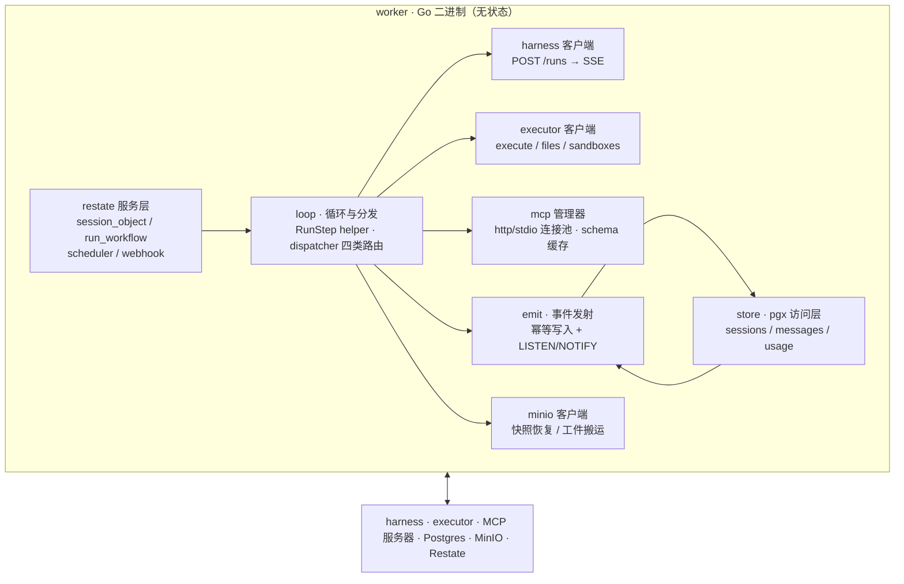

# worker 架构设计（Go · Restate 端点）

> 项目：**Chronotope（时空可组合持久运行时）**
> 上游：[mvp-架构设计.md](./mvp-架构设计.md) · [mvp-落地方案.md](./mvp-落地方案.md)

## 0. 定位：无状态的循环协调者

worker 进程本身**不持有任何持久状态**（无数据库连接池中的业务态、无内存会话对象、无长连接句柄的硬依赖）。它只做三件事：

1. **编排**——run_workflow 的 agent 主循环；
2. **分发**——四类工具路由（API → harness / 代码 → executor / 控制 → awakeable / MCP → MCP 客户端）；
3. **记账**——journal（Restate）与事件投影（Postgres，幂等写入）——**worker 是事件唯一写入者**，api 只订阅分发（SSE/outbox）与聚合（计量）。

崩溃即重启：所有状态在 Restate + Postgres，由 Restate 重放续跑。

## 1. 进程内模块



## 2. 四个 Restate 服务

| 服务 | Restate 类型 | key | 职责 |
|---|---|---|---|
| `session_object` | Virtual Object | session_id | 会话状态机：phase 迁移、plan/记忆游标、MCP schema 缓存、PendingAwakeable；单写者串行 |
| `run_workflow` | Workflow | run_id | agent 主循环：每步 journal，模型输出/沙箱结果/MCP 结果全部走缓存重放 |
| `scheduler` | Workflow（每 schedule 一条） | schedule_id | `Sleep(到点)` → `session_object.wake()` → 建新 run；durable timer 跨重启 |
| `webhook` | Service | — | `POST /webhooks/approval/{run_id}` → resolve awakeable（幂等） |

## 3. run_workflow 主循环（伪代码）

```go
func RunWorkflow(ctx restate.Context, runID string) error {
    sess := sessionRef(runID)                       // 从 session_object 读状态
    cfg  := sess.AgentConfig                        // 模型版本在 run 开始时绑定
    for step := 0; step < cfg.MaxSteps; step++ {
        msgs := sess.Messages                      // 由持久层组装（PG）

        // Step A：一段 harness 调用 = journaled side effect
        hres := restate.Run(ctx, "harness:"+step, func() HarnessResult {
            return harnessClient.Call(ctx, runID, step, msgs, toolSchemas(cfg, sess))
        })
        emit("llm.call", runID, step, hres.Usage)  // 幂等（dedupe key）

        if hres.Kind == Done { emit("run.completed"); finalize(sess, hres); return nil }

        // Step B：工具分发（每类一个 journaled 子步骤）
        for _, call := range hres.ToolCalls {
            switch dispatch(call.Name) {
            case CodeTool:                          // bash/write_file/read_file
                res := restate.Run(ctx, "exec:"+step+":"+call.ID,
                    func() { return executorClient.Execute(ctx, sess.Sandbox, call) })
                emit("sandbox.exec", ...)
                msgs.Append(toolResult(call, res))
            case McpTool:                           // MCP 服务器工具
                res := restate.Run(ctx, "mcp:"+step+":"+call.ID,
                    func() { return mcpManager.Call(ctx, sess, call) })
                emit("mcp.call", ...)
                msgs.Append(toolResult(call, res))
            case ControlTool:                       // request_approval 等
                awakeable := restate.Awakeable[string](ctx)
                sess.PendingAwakeable = awakeable.ID()
                emit("run.awaiting_approval", ...)
                res := restate.Run(ctx, "await:"+step,
                    func() { return awakeable.Result(ctx) })   // 挂起：零进程占用
                emit("run.resumed", ...)
                msgs.Append(toolResult(call, res))
            }
        }
        emit("step.journaled", runID, step)
    }
    emit("run.failed", "max_steps"); return nil
}
```

**重放语义**：`restate.Run` 的闭包只执行一次，结果被 journal；崩溃重放时直接返回缓存结果，闭包不执行——「不重调 harness、不重跑沙箱、不重查 MCP」由引擎保证，而不是靠代码小心。事件插入带 `(run_id, step, kind, tool)` 去重键，重放重复发射时被幂等吞掉。

**图中未画但实现必须包含的两条路径**：
1. **实时流**：`delta` 帧在 harness SSE 闭包内**边收边 emit**（非 journaled 副作用、幂等键 `step:delta:n`、重放时跳过）——否则 UI 只能每 step 结束才见一条汇总，与「SSE 全程收事件」的演示叙事不符；
2. **消息写回**：`msgs.Append` 的结果必须在 journaled Run 内或随幂等 emit 落 PG `messages` 表——伪代码的内存副本若不写回，重放后消息历史缺失。

## 4. session_object 状态模型

```go
type SessionState struct {
    Phase          string       // created|running|sleeping|paused|awaiting_approval|completed|archived
    AgentConfig    AgentConfig  // model+版本、instructions、tools、mcp_servers、skills
    MessageCursor  int64        // 消息历史游标（消息本体在 PG，防状态膨胀）
    Plan           string       // 当前计划（agent 可见）
    MemoryRefs     []string     // 记忆 blob 引用（MinIO）
    Sandbox        SandboxRef   // sandbox_id + image + snapshot_ref
    MCPSchemas     map[string]SchemaVersion  // MCP 工具 schema 缓存（带版本）
    PendingAwakeable string
    LastRunID      string
}
```

**分层原则**：Restate 状态只放**协调态**（游标、引用、版本、小配置）；**大载荷**（消息历史、记忆、工件）在 PG/MinIO。Virtual Object 单写者串行 ⇒ 每 session 同时只有一个活跃 run（新 run 排队或拒绝，MVP 拒绝）。

## 5. 无状态契约与连接生命周期

| 资源 | 谁持有 | worker 重启后 |
|---|---|---|
| 会话/run 状态 | Restate + PG | 自动恢复，无感知 |
| MCP 连接 | worker 内存池（key: session+server） | **懒重建**：下一步用到时按 session 状态里的配置重连；schema 与缓存版本对不上 → 记 `mcp.updated` 事件，run 绑定旧 schema 跑完 |
| 沙箱容器/微VM | executor 服务 | 不重建：按 sandbox_id 找 executor，死了由 executor 负责恢复/重建 |
| harness 连接 | 无（每 call 短连接） | 无状态，天然免疫 |

**设计含义**：worker 进程可以随时被 kill、扩容、发版——因为它什么都不拥有。注意边界：远程部署 worker 实例的前提是**可达 PG / executor / harness / Restate**（并非「只连 Restate」）；「任意空间」的部署能力主要由 executor 单二进制承担，而非 worker。

## 6. 故障矩阵

| 故障 | worker 行为 |
|---|---|
| harness 不可用 | Restate 重试策略重发同一 `(run_id, step)`（幂等），指数退避 |
| executor 不可用 | 同上；沙箱按 sandbox_id 由 executor 恢复 |
| MCP 服务器不可用 | 把错误作为 tool_result 回给模型（模型决定重试/换方案） |
| Postgres 不可用 | step 重试；事件幂等插入兜底 |
| worker 被 kill | Restate 重放：已完成 step 走缓存，进行中 step 重发一次 |
| Restate 引擎重启 | 日志持久化，透明恢复 |

## 7. 并发模型

- 每个 run_workflow invocation 一个 goroutine（Restate SDK 驱动），跨 session 天然并行；
- 同一 session 串行：session_object 单写者 + 每 session 单活跃 run（`queue:true` 的 run 入 `queued` 态按序执行，与契约规范一致）；
- 多租户：org 级 quota 在 run 启动时由 api 校验，worker 不感知计费。

## 8. 对外端口清单

| 对端 | 协议 | 用途 |
|---|---|---|
| api | HTTP（内部） | run 启动信号 / 事件回调（LISTEN/NOTIFY 之外的控制面调用） |
| harness | `POST /runs` → SSE | 每段模型调用 |
| executor | `execute` / `files` / `sandboxes` | 代码工具与沙箱生命周期 |
| MCP 服务器 | MCP（http/stdio） | 外部工具 |
| Postgres | pgx | sessions/messages/events/usage |
| MinIO | S3 | 快照恢复、工件搬运 |
| Restate | SDK 内嵌 | journal/state/timer/awakeable |
